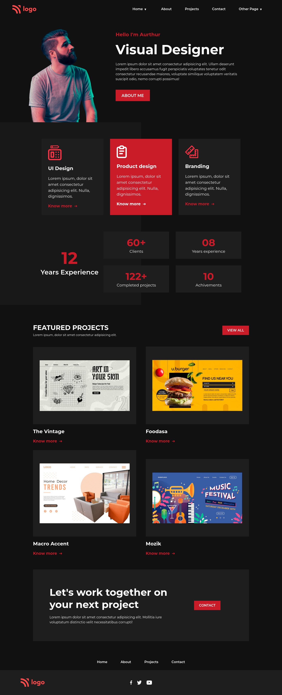

# This is Portfolio site for a product designer

Made by **Aditya Kadali**

## Screenshots:

## Built with:

- Semantic HTML5
- Custom CSS Classes
- Flexbox layout
- Grid layout

## Key learnings:

- In this project I learned to combine flex and grid to achive the look we wanted.
- Learned to use gradients and create interesting backgrounds using them.
- Learned to use utility classes more effectively.

## Time taken:

- This project took me 3 hours to build from scratch.

## Links:

- [Live demo](https://product-designers.netlify.app/)
- [Source code](https://github.com/Adityakadali/product-designer-portfolio)
